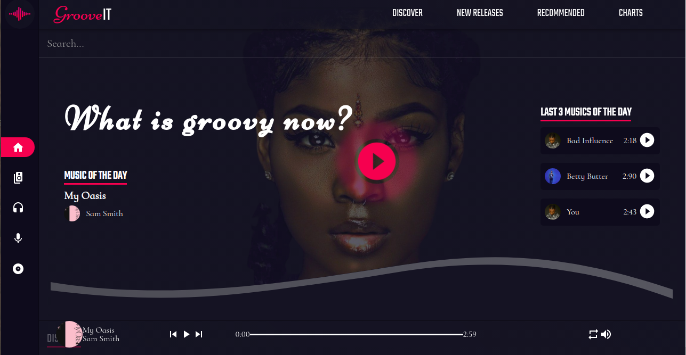
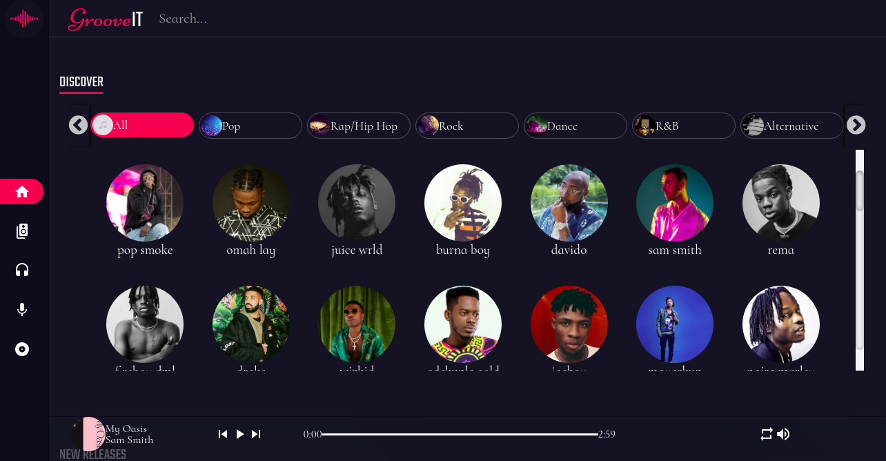
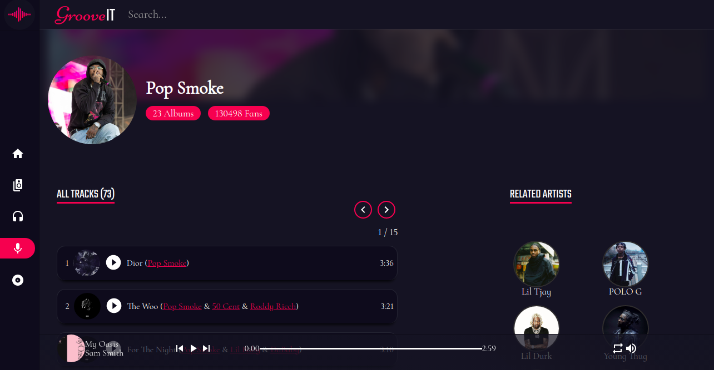

[![Contributors][contributors-shield]][contributors-url]
[![Forks][forks-shield]][forks-url]
[![Stargazers][stars-shield]][stars-url]
[![Issues][issues-shield]][issues-url]
[![MIT License][license-shield]][license-url]

<p align="center">
  <a href="https://www.ruby-lang.org/en/">
    
    
  </a>
</p>

### Groovy-It Music App

A music app built with the React and Redux frameworks. It shows music artist accoring to the genres and each artist page contains a list of music tracks and album for that artist. The project name for this project is [Catalogue of Dog Clothes](https://www.notion.so/Catalogue-of-Dog-Clothes-8bf1512b8ab34fa28848beb8ab698a32) from the project requirement.

## Table of Contents

- [About Project](#about-project)
- [Screen Shots And Presentation](#screen-shots)
- [Built With](#built-with)
- [Technologies Employed](#technologies-employed)
- [Live Preview](#live-preview)
- [Required Installations](#required-installations)
- [App Installation](#instalation)
- [Future Features](#future-features)
- [License](#license)
- [Author](#author)
- [Acknowledgements](#acknowledgements)

<!-- User features -->

## About Project

  This project is a Music App built with React and Redux. It implements the functionality of building components in React and connecting the components to fetch data from an API then use the Redux store using Redux actions, reducers and methods.

  In this project, the complete feature of the app renders the following:

  Used the [Deezer API](https://developers.deezer.com/api) for the music data collection.
  A user can view all list of genres of music and artists.
  A user can filter of the artist based on the music genres.
  A user can view a single artist.
  A user can view a single artist track.
  A user can view a single artist album tracks.
  A user can view new released tracks, recommended tracks and top chart information.
  A user can listen to audio music. A play, pause and replay features were also implemented.
  A user can search for music tracks.
  A user can toggle between dark and light mode.
  A user can navigate throught the pages of the site:

* Home Page - Genre/Category page.
* Artist (Artist tracks) Page
* Album Page
* Genre Page

<!-- Screen shots -->

## Screen Shots And Presentation




<br>

* You can watch a live demostration of the project using this link - https://www.loom.com/share/13ccdf43aa77463892726c600d6ba21a

<!-- BUILT WITH -->

# Built With

- VsCode
- Git

<!-- TECHNOLOGIES EMPLOYED -->

# Technologies Employed

- React Thunk
- Redux Store
- React Routers
- Jest auto watch
- CSS Modules
- Node.js
- React
- React-DOM
- React-Create-App
- Redux
- npm
- CSS
- ES6
- React-thunk

<!-- LIVE PREVIEW -->

## LIVE PREVIEW
* Here is a link to the live version of the app - [Groovy-IT Music App](https://groove-it.netlify.app/)
<!-- REQUIRED INSTALLATION -->

## REQUIRED INSTALLATIONS

- node
- git

<!-- INSTALLATION -->

## Installation of This Repository
To allows localhost to send cross-domain requests to the Deezer API, you can override Request Origin and CORS headers by installing this extension on your browser [Moesif Orign & CORS Changer](https://chrome.google.com/webstore/detail/moesif-orign-cors-changer/digfbfaphojjndkpccljibejjbppifbc)


Clone the Repository,

```Shell
your@pc:~$ git clone https://github.com/adaorachi/React_capstone.git
```

Go to the downloaded folder

```Shell
your@pc:~$ cd React_capstone
```

Install all packages

```Shell
your@pc:~$ npm install
```

Start the server

```Shell
your@pc:~$ npm start
```

The app will open on your local host port 3000.

<!-- run tests -->

## Run tests

Run all tests

```Shell
your@pc:~$ npm test
```

Run specific tests

```Shell
your@pc:~$ npm test src/tests/<testfile>
```

<!-- Future features -->

## Future Features

- Work on front-end reponsiveness.

## Learn More

You can learn more in the [Create React App documentation](https://facebook.github.io/create-react-app/docs/getting-started).

To learn React, check out the [React documentation](https://reactjs.org/).

# Author

**MaryAnn Chukwuka**

- Github: [@adaorachi](https://github.com/adaorachi)
- Twitter: [@Chukwuka_maryann](https://twitter.com/adaorachi)
- Linkedin: [MaryAnn Chukwuka](https://https://www.linkedin.com/in/adaorachi/)
  <br />

# License

This project is licensed under the MIT License - see the [LICENSE.md](LICENSE.md) file for details

<!-- ACKNOWLEDGEMENTS -->

## Acknowledgements

- [Microverse](https://www.microverse.org/)
- [The Odin Project](https://www.theodinproject.com/)

<!-- MARKDOWN LINKS & IMAGES -->
<!-- https://www.markdownguide.org/basic-syntax/#reference-style-links -->

[contributors-shield]: https://img.shields.io/github/contributors/adaorachi/React_capstone.svg?style=flat-square
[contributors-url]: https://github.com/adaorachi/React_capstone/graphs/contributors
[forks-shield]: https://img.shields.io/github/forks/adaorachi/React_capstone
[forks-url]: https://github.com/adaorachi/React_capstone/network/members
[stars-shield]: https://img.shields.io/github/stars/adaorachi/React_capstone
[stars-url]: https://github.com/adaorachi/React_capstone/stargazers
[issues-shield]: https://img.shields.io/github/issues/adaorachi/React_capstone
[issues-url]: https://github.com/adaorachi/React_capstone/issues
[license-shield]: https://img.shields.io/github/license/adaorachi/React_capstone
[license-url]: https://github.com/adaorachi/React_capstone/blob/master/LICENSE.txt